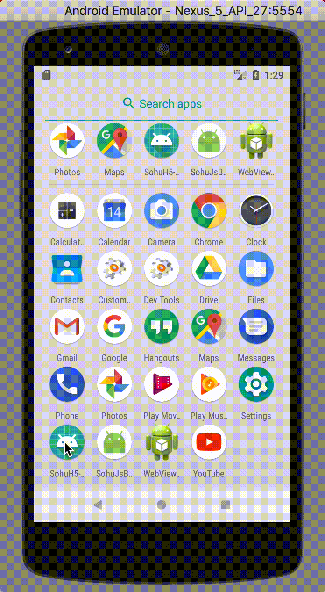

# Android 端交互文档

### 0、添加依赖

- 将 com.sohu.h5nativeinteraction.library 这个包添加到你的工程
- 将 shwebview.js 文件放到 assets 里

### 1、调用 H5 提供的方法

使用 SHWebView 对象调用 **callH5Method(String method,JSONObject data,SHWebViewOnH5Response response)** 方法即可。

```java
/**
 * @param method H5调用的方法名
 * @param data 传递给H5的参数
 * @param response 给H5发送回执
 */
public void callH5Method(String method,JSONObject data,SHWebViewOnH5Response response);
```

ps : 如果 H5 没有注册名为 method 的处理，也不会导致崩溃!

### 2、支持 H5 调用 Android

跟 H5 支持 Native 调用是一个道理，Android 需要注册下 H5 需要调用的方法！

```java
/**
 * @param method H5调用的方法名
 * @param handler 接收到H5的参数，还有给 H5发送回执的接口
 */
public void registerMethod(String method,SHWebNativeHandler handler);
```

举例说明：

```java
///注册了一个 showMsg 方法，H5 就可调用showMsg方法了，ps 是 H5 传过来参数
mWebView.registerMethod("showMsg", new SHWebView.SHWebNativeHandler() {
            @Override
            public void on(JSONObject ps, SHWebView.SHWebSendH5Response h5Response) {
                String text = ps.optString("text");
                TextView tv = findViewById(R.id.textView);
                tv.setText(text);
                tv.setBackgroundColor(Color.argb(255, (int) (Math.random() * 256), (int) (Math.random() * 256), (int) (Math.random() * 256)));
                JSONObject json = new JSONObject();
                try {
                    json.put("status", 200);
                    h5Response.send(json);
                } catch (JSONException e) {
                    e.printStackTrace();
                }
            }
        });    
```

# 效果


