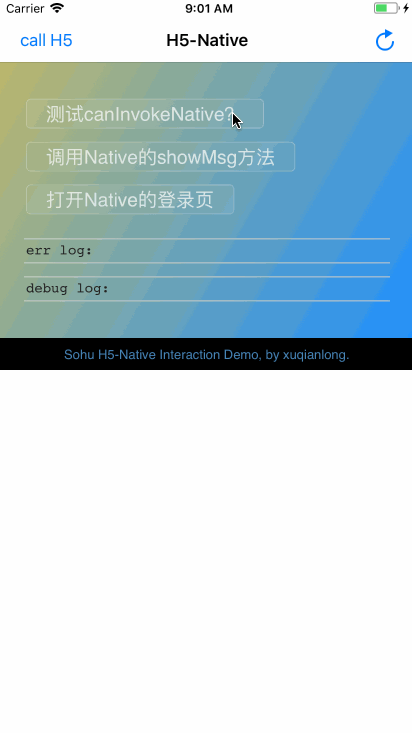

# iOS 端使用文档

### 0、将 H5-NativeInteraction 文件夹添加到你的工程

### 1、调用 H5 提供的方法

使用 SHWebView 对象调用 **callH5Method:data:responseCallback:** 方法即可。

```
/**
 调用 H5 的方法
 
 @param method 方法名
 @param data 参数
 @param responseCallback H5的回调
 */
- (void)invokeH5:(NSString*)method data:(NSDictionary *)data responseCallback:(SHJSBridgeSendResponse)responseCallback;
```

ps : 如果 H5 没有注册名为 method 的处理，也不会导致崩溃!

### 2、支持 H5 调用 iOS

跟 H5 支持 Native 调用是一个道理，iOS 需要注册下 H5 需要调用的方法！

```objc
/**
 注册要处理的事件
 
 @param method H5调用的方法名
 @param handler 接收到H5的参数,在主线程回调
 */
- (void)registerMethod:(NSString *)method handler:(SHJSBridgeOnH5Message)handler;
```

举例说明：

```objc
///注册了一个 showMsg 方法，H5 就可调用showMsg方法了，ps 是 H5 传过来参数
[self.webView registerMethod:@"showMsg" handler:^(NSDictionary *ps, SHJSBridgeSendResponse callback) {
    _strongSelf_SH
    self.info.text = ps[@"text"];
    self.info.backgroundColor = [UIColor blackColor];
    ///处理完消息后，给H5一个回调
    callback(@{@"status":@(200)});
}];
    
```

# 效果



# sh://iamready

通过这段日志可以看出 sh://iamready 的重要性！

```
2018-07-16 23:04:40.153881+0800 SohuH5-NativeInteraction[72225:6021456] TIC TCP Conn Failed [2:0x60c000177340]: 3:-9800 Err(-9800)
2018-07-16 23:05:55.918602+0800 SohuH5-NativeInteraction[72225:6024610] TIC TCP Conn Failed [3:0x60c000177280]: 3:-9800 Err(-9800)
2018-07-16 23:07:11.797406+0800 SohuH5-NativeInteraction[72225:6026857] TIC TCP Conn Failed [4:0x608000174c40]: 3:-9800 Err(-9800)
2018-07-16 23:07:11.798090+0800 SohuH5-NativeInteraction[72225:6026857] NSURLSession/NSURLConnection HTTP load failed (kCFStreamErrorDomainSSL, -9800)
2018-07-16 23:07:11.798286+0800 SohuH5-NativeInteraction[72225:6026857] Task <21B6F71C-3096-4B15-B434-10E2D3415625>.<0> HTTP load failed (error code: -1200 [3:-9800])
2018-07-16 23:07:11.798480+0800 SohuH5-NativeInteraction[72225:6027329] NSURLConnection finished with error - code -1200
```
